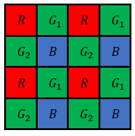
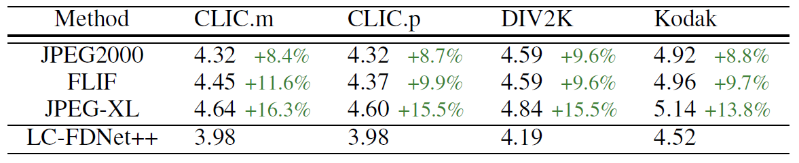
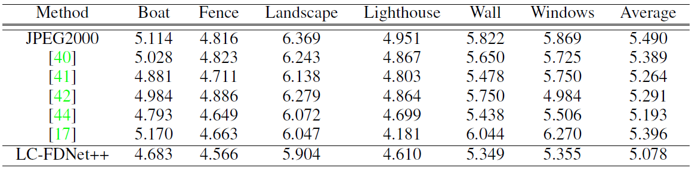

## About Branches
We provide 3 branches, where each branch is the code of the following implementation.

- Main Branch : Implementation for RGB image compression
- Raw : Implementation for 8-bit raw image compression
- Raw16 : Implementation for 16-bit raw image compression


### LC-FDNet++ for CFA raw image compression
<p align="center"></p>

We perform lossless image compression for raw images in this branch. Specifically, we execute compression for 8-bit CFA sampled images, which are sampled by the above bayer pattern.

## Experimental Results

<p align="center"></p>

Compression result on 7-bit CFA sampled dataset.

<p align="center"></p>

Compression result on CFA simulated Kodak samples.

## Dataset
Train Dataset

[FLICKR2K] (https://github.com/limbee/NTIRE2017)

Test Dataset

[DIV2K] (https://data.vision.ee.ethz.ch/cvl/DIV2K/)

[CLIC] (http://clic.compression.cc/2019/challenge/)

[Kodak] (http://r0k.us/graphics/kodak/)


## Brief explanation of contents

```
|── experiments
    ├──> experiment_name 
         ├──> ckpt : trained models will be saved here
         └──> log  : log will be saved here
|── dataset
    ├──> dataset_name1 
         ├──> train : training images of dataset_name1 should be saved here
         └──> test  : test images of dataset_name1 should be saved here
    ├──> dataset_name2
         ├──> train : training images of dataset_name2 should be saved here
         └──> test  : test images of dataset_name2 should be saved here         
|── utils : files for utility functions
|── config.py : configuration should be controlled only here 
|── lcfdnet_plust_env.yml : virtual enviornment specification
|── model.py : architecture of LC-FDNet++
|── eval.py : evaluate the model
|── train.py : train the model
└── jpegxl : folder for jpegxl library. explained below.

```

We use 'torchac' library as our arithmetic coder, which is available at https://github.com/fab-jul/torchac.

## Dataset directory guideline

Your dataset directory should look something like the following

```
|── dataset
    ├──> div2k 
         ├──> train
         └──> test  
    ├──> div2k_down2
    ├──> div2k_down3    
    ├──> div2k_down4 
    ├──> flickr
    ├──> flickr_down2
    ├──> flickr_down3    
    ├──> flickr_down4     

```

Note that we do not provide an automatic code for generating the downsample version of the dataset.

## Guidelines for Training / Evaluation Codes

1. Install JPEG-XL
   1) Download JPEG-XL from https://gitlab.com/wg1/jpeg-xl and follow the installation process
   2) Change the directory name 'libjxl' to 'jpegxl'

2. Check configurations from config.py

3. Run the following command for training  the network
```
python train.py --gpu_num=0 --experiment_name='default/' --train_dataset='flickr/' --test_dataset='div2k/'
```

The trained model will be saved in the following directory : experiments/default/ckpt

4. Run the following command for testing the network.
   
   **** parameter empty_cache in config.py should be set to True if memory issue occurs ****
```
python eval.py --gpu_num=0 --experiment_name='default/' --test_dataset='div2k/' --empty_cache=True
```

## Guidelines for running Pretrained Network for Evaluation
1. Run the following command for evaluating the pretrained network.
   
   **** parameter empty_cache in config.py should be set to True if memory issue occurs ****
```
python eval.py --gpu_num=0 --experiment_name='pretrained/' --test_dataset='div2k/' --test_downscale_ratio=2 --empty_cache=True
```

The following command will evaluate for dataset 'div2k' with a downsampled ratio of '2'.
If you wish to evaluate for different dataset and different downsample ratio, just change the configuration parameter.
