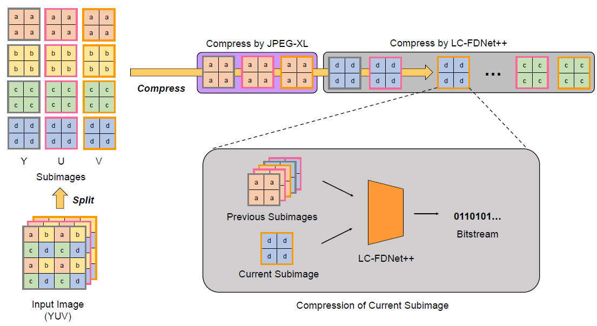
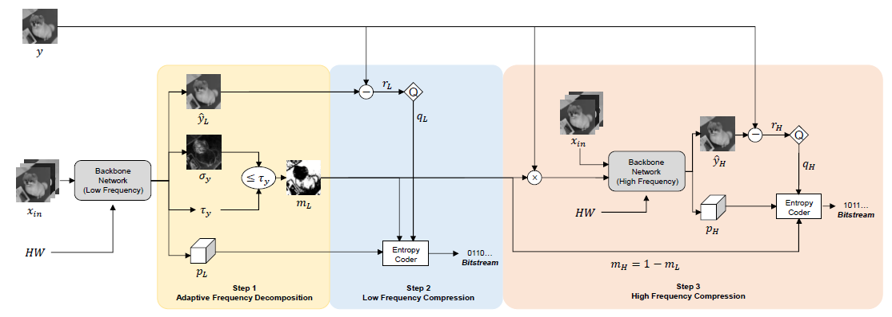
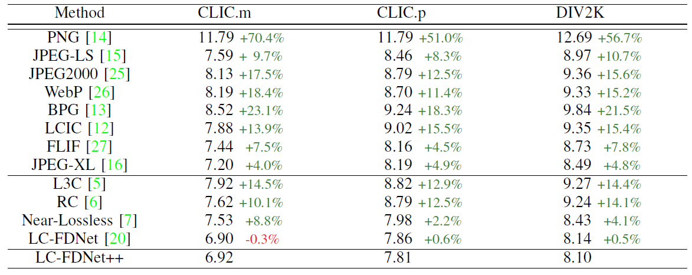

# LC-FDNet++

# [Lossless COmpression of RGB and Raw Imags by Learning the Prediction and Frequency Decomposition]

Hochang Rhee, Seyun Kim, Nam Ik Cho

## About Branches
We provide 3 branches, where each branch is the code of the following implementation.

- Main Branch : Implementation for RGB image compression
- Raw : Implementation for 8-bit raw image compression
- Raw16 : Implementation for 16-bit raw image compression

## Environments
- Ubuntu 18.04
- Pytorch 1.7.0
- CUDA 10.0.130 & cuDNN 7.6.5
- Python 3.7.7

You can type the following command to easily build the environment.
Download 'fdnet_env.yml' and type the following command.

```
conda env create -f fdnet_env.yml
```

## Abstract

This paper presents a learned lossless image compression method that attempts to maximize the use of correlations from two perspectives. First, we adopt a hierarchical method for decomposing an input into subimages and proceed with the subimage encoding with a new encoding order. This enables the current pixel encoder to fully utilize the horizontal, vertical, and diagonal components of previous subimages. Secondly, for each subimage, we compress the low-frequency components first
and use them as additional input for encoding the remaining high-frequency components. In this scenario, the high-frequency components show improved compression efficiency since they use the low-frequency ones as strong prior. In addition to improving the compression performance, we make our method robust to dataset-dependency problems, specifically the performance differences depending on the input resolution, by introducing resolution-specific kernels. Furthermore, we extend our method
to color filter array (CFA) image compression and show that our method is also applicable to 8∼16 bits raw images. Experiments show that the proposed method achieves state-ofthe-art performance for benchmark high and low-resolution datasets along with CFA images.

## Brief Description of Our Proposed Method
### Framework of our compresion scheme
<p align="center"></p>

Illustration of the overall compression scheme. We first split the input into 12 subimages (four for each channel) depending on spatial location and color channel, where the border color of a subimage represents the color channel. Then, we compress the subimages one by one. The first 3 subimages (x_(Y,a), x_(U,a), x_(V,a)) are compressed using a conventional codec JPEG-XL, and the remaining 9 subimages are compressed using our LC-FDNet++. For the compression of the current subimage
using the LC-FDNet++, previously compressed subimages are also used as inputs.

### Architecture of LC-FDNet++
<p align="center"></p>

The encoder architecture of LC-FDNet++. In this figure, we consider the case of compressing y = x_(Y,d) given x_in = {x_(Y,a), x_(U,a), x_(V,a)}. The adaptive frequency decomposition (AFD) part first receives x_in and determines whether each pixel belongs to either low or high-frequency regions, using error variance map σy and error variance threshold τy that are explained in Subsection II-C. Then, the low-frequency compression (LFC) encodes the low-frequency region of the subimage y. The high-frequency compression (HFC) then receives the encoded low-frequency region as additional input and compresses the remaining high-frequency region.

## Experimental Results

<p align="center"></p>

Comparison of our method and other non-learning and learning-based codecs on high-resolution benchmark datasets. We measure the performances in bits per pixel (bpp). The best performance is highlighted in bold. The difference in percentage to our method is highlighted in green if ours outperform and in red otherwise.

## Dataset
Train Dataset

[FLICKR2K] (https://github.com/limbee/NTIRE2017)

Test Dataset

[DIV2K] (https://data.vision.ee.ethz.ch/cvl/DIV2K/)

[CLIC] (http://clic.compression.cc/2019/challenge/)

[Kodak] (http://r0k.us/graphics/kodak/)

[McMaster] (https://www4.comp.polyu.edu.hk/~cslzhang/CDM_Dataset.htm)

[Classic] (We provide the classic dataset in our repository, in the dataset/classic folder)


## Brief explanation of contents

```
|── experiments
    ├──> experiment_name 
         ├──> ckpt : trained models will be saved here
         └──> log  : log will be saved here
|── dataset
    ├──> dataset_name1 
         ├──> train : training images of dataset_name1 should be saved here
         └──> test  : test images of dataset_name1 should be saved here
    ├──> dataset_name2
         ├──> train : training images of dataset_name2 should be saved here
         └──> test  : test images of dataset_name2 should be saved here         
|── utils : files for utility functions
|── config.py : configuration should be controlled only here 
|── lcfdnet_plust_env.yml : virtual enviornment specification
|── model.py : architecture of LC-FDNet++
|── eval.py : evaluate the model
|── train.py : train the model
└── jpegxl : folder for jpegxl library. explained below.

```

We use 'torchac' library as our arithmetic coder, which is available at https://github.com/fab-jul/torchac.

## Guidelines for Training / Evaluation Codes

1. Install JPEG-XL
   1) Download JPEG-XL from https://gitlab.com/wg1/jpeg-xl and follow the installation process
   2) Change the directory name 'libjxl' to 'jpegxl'

2. Check configurations from config.py

3. Run the following command for training  the network
```
python train.py --gpu_num=0 --experiment_name='default/' --train_dataset='flickr/' --test_dataset='div2k/'
```

The trained model will be saved in the following directory : experiments/default/ckpt

4. Run the following command for testing the network.
   
   **** parameter empty_cache in config.py should be set to True if memory issue occurs ****
```
python eval.py --gpu_num=0 --experiment_name='default/' --test_dataset='div2k/' --empty_cache=True
```

## Guidelines for running Pretrained Network for Evaluation
1. Run the following command for evaluating the pretrained network.
   
   **** parameter empty_cache in config.py should be set to True if memory issue occurs ****
```
python eval.py --gpu_num=0 --experiment_name='pretrained/' --test_dataset='div2k/' --test_downscale_ratio=2 --empty_cache=True
```

The following command will evaluate for dataset 'div2k' with a downsampled ratio of '2'.
If you wish to evaluate for different dataset and different downsample ratio, just change the configuration parameter.
