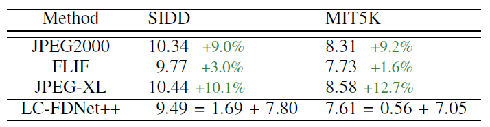

## About Branches
We provide 3 branches, where each branch is the code of the following implementation.

This branch is 'Raw16', where we perform lossless compression for 16-bit CFA sampled images.

- Main Branch : Implementation for RGB image compression
- Raw : Implementation for 8-bit raw image compression
- Raw16 : Implementation for 16-bit raw image compression


### LC-FDNet++ for CFA raw image compression
We perform lossless image compression for raw images in this branch. Specifically, we execute compression for 16-bit raw images, which are in the form of RGGB.

## Experimental Results

<p align="center"></p>

Compression result on 16-bit raw dataset.

## Dataset
Train Dataset

[SIDD] (https://www.eecs.yorku.ca/~kamel/sidd/dataset.php)

[MIT5K] (https://data.csail.mit.edu/graphics/fivek/)

Test Dataset

[SIDD] (https://www.eecs.yorku.ca/~kamel/sidd/dataset.php)

[MIT5K] (https://data.csail.mit.edu/graphics/fivek/)

In the case of MIT5K, images used as the test set are specified in 'mit5k_testnames.txt'

## Dataset Explanation
SIDD

We download the SIDD Dataset, which contains 160 images with a bit depth of 16.
We convert the mat files into images.
Then we place the images in 'dataset/SIDD16/train/' or 'dataset/SIDD16/test/'.
Afterwards, when we run 'train.py' or 'eval.py', the dataloader of our code first determines the camera type of the image (GP, IP, S6, N6, G4).
According to the camera type, we rearrange the image to be in the form of Bayer pattern RGGB.

MIT5K

We download the MIT5K Dataset, which contains 5,000 images with a bit depth of 10~14.
Through 'mit2png.py', we first convert the MIT5K dataset, which is in the form of dng extension, to 16-bit png image.
These 16-bit png images are all in the form of Bayer pattern RGGB.

## Brief explanation of contents

```
|── experiments
    ├──> experiment_name 
         ├──> ckpt : trained models will be saved here
         └──> log  : log will be saved here
|── dataset
    ├──> dataset_name1 
         ├──> train : training images of dataset_name1 should be saved here
         └──> test  : test images of dataset_name1 should be saved here
    ├──> dataset_name2
         ├──> train : training images of dataset_name2 should be saved here
         └──> test  : test images of dataset_name2 should be saved here         
|── utils : files for utility functions
|── config.py : configuration should be controlled only here 
|── model.py : architecture of LC-FDNet++
|── eval.py : evaluate the model
|── train.py : train the model
|── mit2png.py : Converts the dng raw file into RGGB png file. 
└── flif : folder for flif library.

```

We use 'torchac' library as our arithmetic coder, which is available at https://github.com/fab-jul/torchac.

## Dataset directory guideline

Your dataset directory should look something like the following

```
|── dataset
    ├──> SIDD16 
         ├──> train
         └──> test  
    ├──> MIT5K
         ├──> train
         └──> test   

```

## Guidelines for Training / Evaluation Codes

1. Install FLIF
   1) Download FLIF from https://github.com/FLIF-hub/FLIF/blob/master/README.md and follow the installation process
   2) Change the directory name to 'flif'

2. Check configurations from config.py

2.5. In the case of MIT5K
     place mit5k train images in dataset/mit_dng/train and
     place mit5k test images in dataset/mit_dng/test.
     Then run mit2png for subset 'train' and 'test' (line 11 for mit2png.py).
     The images will be saved in mit16/train and mit16/test, which are in the form of RGGB png image.

3. Run the following command for training  the network
```
python train.py --gpu_num=0 --experiment_name='default/' --train_dataset='SIDD16/' --test_dataset='SIDD16/'

or

python train.py --gpu_num=0 --experiment_name='default/' --train_dataset='mit16/' --test_dataset='mit16/'
```

The trained model will be saved in the following directory : experiments/default/ckpt

4. Run the following command for testing the network.
   
   **** parameter empty_cache in config.py should be set to True if memory issue occurs ****
```
python eval.py --gpu_num=0 --experiment_name='default/' --test_dataset='SIDD/' --empty_cache=True

or

python eval.py --gpu_num=0 --experiment_name='default/' --test_dataset='mit16/' --empty_cache=True
```

## Guidelines for running Pretrained Network for Evaluation
1. Run the following command for evaluating the pretrained network.
   
   **** parameter empty_cache in config.py should be set to True if memory issue occurs ****
```
python eval.py --gpu_num=0 --experiment_name='SIDD_pretrained/' --test_dataset='SIDD16/' --empty_cache=True

or

python eval.py --gpu_num=0 --experiment_name='mit16_pretrained/' --test_dataset='mit16/' --empty_cache=True
```
If you wish to evaluate for different dataset, just change the configuration parameter.
